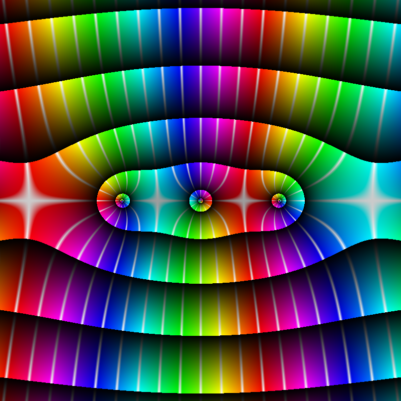

#Complex Plane Plotter
Output a plot of a function from ℂ to ℂ.

Hue of a pixel represents the argument and brightness represents the modulus.

## How to use it

int[] pixels = Plotter.plot(f, width, height, x start, y start, x end, y end, coloring)

* **f** must be a lambda expression with the function you want to plot (i.e. z -> Complex.ln(z))

* **width**, **height**: dimensions of the output image

* **x start/end**: real interval of the function

* **y start/end**: imaginary interval

* **coloring**: You can combine the two with | operator.
    * **0b01** / **Plotter.PLOTMOD**: reset the brightness when magnitude is greater than an integer power of 2 
    * **0b10** / **Plotter.PLOTLINES**: draw white lines at regular arguments intervals
<figure class="image"></img><figcaption>Plain image</figcaption></figure>
<figure class="image"></img><figcaption>Magnitude mod</figcaption></figure>
<figure class="image"></img><figcaption>Argument lines</figcaption></figure>
<figure class="image"></img><figcaption>Both</figcaption></figure>

### Example of usage:
	Plotter.plot(z -> Complex.mul(z,Complex.cos(z)), 800, 800, -4, -4, 4, 4, 0b11); 
&nbsp;</img>

### Output:
Plotter.plot() returns an int raster with the image

In the main class there's a method to convert it into a BufferedImage

## Dependencies
You need my complex numbers library to run this program: [Complex Numbers Library](https://github.com/MrCamoga/Complex-Numbers)